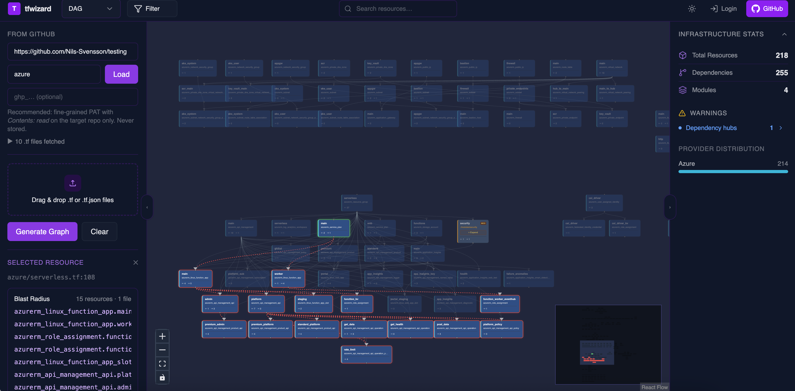

# tfwizard

**Interactive infrastructure visualization from Terraform files**

www.tfwizard.com

tfwizard is a web application that generates **interactive diagrams from Terraform files**, allowing you to **visualize and explore cloud infrastructure** at a glance. Load any Terraform repository — local or from GitHub — and instantly see your resources, their dependencies, and how they relate to each other.

> Note: This project is under active development.

---

---

## Features

### Visualization
- **Two layout modes** — DAG (hierarchical, depth-based) and Radial (circular, component-centric)
- **Dependency edges** — directed arrows show which resources depend on which
- **Blast radius** — click any node to highlight all resources it affects transitively
- **Module expansion** — expand Terraform module nodes to inspect their internal resources inline

### Navigation & filtering
- **Search** — filter the graph to matching resources in real time
- **Category filter** — highlight resources by category (compute, storage, networking, database, serverless, IAM, and more) across AWS, GCP, and Azure
- **Dark / light theme** toggle

---

## Architecture & CI/CD

tfwizard is structured as **three services**:

1. **Frontend** — React / TypeScript SPA (XYFlow for graph rendering, Tailwind for styling)
2. **Backend** — Go API handling Terraform parsing, graph construction, and analysis
3. **Proxy** — Go service that authenticates and forwards requests to an IAM-protected backend using Google Cloud identity tokens

All services are containerized with **Docker** and deployed to **Google Cloud Run**.

The project includes a **fully automated CI/CD pipeline** powered by **GitHub Actions**:

- Builds, tests, containerizes, and deploys services on every push
- Pushes Docker images to **Artifact Registry**
- Deploys only services that changed using **path-based filtering**
- Manages infrastructure as code via **Terraform**

---

## Roadmap

- Stats panel — resource counts, depth distribution, component breakdown
- Diff view — compare two snapshots of the same infrastructure over time
- World map — visualize resource distribution by cloud region
